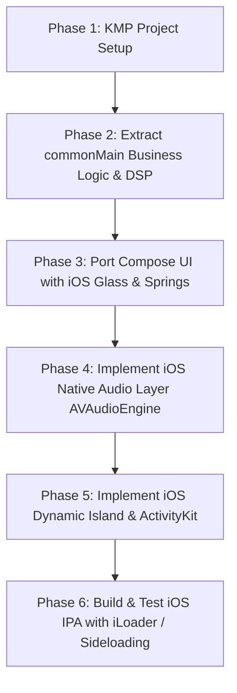

# Aurio iOS Compatibility & Kotlin Multiplatform Implementation Plan

This implementation plan details the strategy to make **Aurio** fully compatible with **iOS** while maintaining **100% feature parity** with the Android app and ensuring the **Android version remains completely undisturbed, stable, and functional** at every stage.

---

## 1. Architectural Strategy: Kotlin Multiplatform (KMP) + Compose Multiplatform

To achieve full iOS compatibility without maintaining two separate codebases or rewriting the entire application:

```
                                  ┌─────────────────────────────────────────┐
                                  │          Shared (:composeApp)           │
                                  │               commonMain                │
                                  │                                         │
                                  │  • 100% Compose UI & Claymorphic Theme │
                                  │  • 8D / 16D Spatial Audio DSP Math      │
                                  │  • ViewModels & Application State       │
                                  │  • Music Discovery & Innertube Engine   │
                                  │  • Supabase Auth & Cloud Sync           │
                                  │  • Listen Together WebSockets           │
                                  │  • Synchronized Lyrics Parser           │
                                  │  • Shared Player State & Interface      │
                                  └────────────┬────────────────────────────┘
                                               │
                       ┌───────────────────────┴───────────────────────┐
                       │                                               │
                       ▼                                               ▼
         ┌───────────────────────────┐                   ┌───────────────────────────┐
         │        androidMain        │                   │          iosMain          │
         │ (Existing Android App)    │                   │   (New iOS Integration)   │
         │                           │                   │                           │
         │ • ExoPlayer / Media3      │                   │ • AVAudioEngine / AVPlayer│
         │ • System Window Overlay   │                   │ • Native Apple ActivityKit│
         │   (Camera Hole Dynamic    │                   │   (Hardware Dynamic Island│
         │    Island for Android)    │                   │    & Live Activities)     │
         │ • Android Foreground Svc  │                   │ • iOS Background Audio Svc│
         │ • Android Vibrator Haptics│                   │ • Apple CoreHaptics Engine│
         │ • OpenWakeWord (TFLite)   │                   │ • Apple Speech / CoreML   │
         └───────────────────────────┘                   └───────────────────────────┘
```

---

## 2. Complete Feature-by-Feature iOS Parity Mapping

Every single feature present in the Android Aurio app is mapped to its exact iOS implementation:

| # | Aurio Feature | Android Implementation (`androidMain`) | iOS Implementation (`iosMain`) | Sharing Strategy |
|---|---|---|---|---|
| **1** | **Audio Playback Engine** | Android Media3 / ExoPlayer | Apple `AVAudioEngine` & `AVPlayer` | Shared `AudioPlayer` interface with platform expect/actual implementations |
| **2** | **8D & 16D Spatial Audio DSP** | Pure Kotlin DSP in `SpatialAudioProcessor.kt` (Linkwitz-Riley crossover, Hermite delay, 3D Pinna filtering, 16D Duality Orbit) | Pure Kotlin Native DSP (compiled via Kotlin/Native directly into iOS audio tap / buffer) | **100% Shared Code in `commonMain`** |
| **3** | **Dynamic Island & Live Miniplayer** | `WindowManager` System Alert Window floating overlay around camera notch + expanded controls | Apple **ActivityKit & WidgetKit** (Hardware Dynamic Island: Compact Leading/Trailing, Minimal, Expanded View & Lock Screen Live Activity) | Platform-specific native bridge with shared playback state |
| **4** | **Music Haptics & Vibration Sync** | Android `Vibrator` / `VibrationEffect` with audio envelope tracking | Apple `CoreHaptics` (`CHHapticEngine`) with dynamic transient & continuous haptic patterns | Shared beat-detection triggers + platform haptic player |
| **5** | **AI Assistant & Voice Commands** | `AurioAiAssistantEngine`, OpenWakeWord TFLite, Android SpeechRecognizer, Android TTS | `AurioAiAssistantEngine` (shared), Apple `SFSpeechRecognizer`, Apple `AVSpeechSynthesizer`, CoreML / Apple Speech trigger | Shared AI reasoning & prompt engine in `commonMain` |
| **6** | **Music Streaming & Search Engine** | `InnertubeClient.kt` & `MusicRepository.kt` (YouTube Music, JioSaavn streams & search) | Shared `InnertubeClient` using Ktor / OkHttp Multiplatform | **100% Shared Code in `commonMain`** |
| **7** | **Listen Together (Social Co-Listening)** | `RoomRepository.kt`, `RoomSessionManager.kt` (Supabase Realtime WebSockets, synced queue, chat) | Supabase Kotlin Realtime WebSocket client | **100% Shared Code in `commonMain`** |
| **8** | **Authentication & Cloud Sync** | `AuthRepository.kt`, `SupabaseClient.kt`, Google Sign-In, Email OTP | Supabase Auth Kotlin + Apple Sign-In (`AuthenticationServices`) & Google Sign-In iOS SDK | Shared Auth state and repository in `commonMain` |
| **9** | **Synchronized Lyrics Engine** | `LyricsRepository.kt` (LRCLIB time-synced lyrics with karaoke word highlights) | Shared `LyricsRepository` & Compose karaoke highlight UI | **100% Shared Code in `commonMain`** |
| **10** | **Downloads & Offline Caching** | Android `DownloadManager` / internal file storage | iOS `URLSessionDownloadTask` & App Sandbox Documents storage | Shared download queue state + platform file sink |
| **11** | **UI, Curved Navbar & Themes** | Jetpack Compose Claymorphic theme, FullPlayerScreen, animations, Canvas visualizers | Compose Multiplatform (UIKit view controller wrapper) | **100% Shared Code in `commonMain`** |

---

## 3. Detailed Subsystem Porting Architecture

### 3.1. Audio Engine & DSP (8D / 16D Spatial Audio)
* **Shared Code (`commonMain`)**:
  * `SpatialAudioProcessor`: The exact math algorithms created for Aurio (Linkwitz-Riley 160 Hz crossover, 4-point Cubic Hermite delay lines, anatomical pinna frequency notches, 16D Duality counter-orbit, and loudness normalization) are written in pure Kotlin and run on iOS with zero modification.
* **iOS Implementation (`iosMain`)**:
  * Utilize `AVAudioEngine` with an `AVAudioSourceNode` or `MTAudioProcessingTap` to stream PCM audio buffers through the shared `SpatialAudioProcessor`.
  * Configure `AVAudioSession` category to `.playback` with `.mixWithOthers` and `.allowBluetoothA2DP` for background audio and Bluetooth headphone support.
  * Integrate `MPNowPlayingInfoCenter` and `MPRemoteCommandCenter` for iOS Lock Screen, Control Center, and Apple Watch media controls.

### 3.2. Apple Native Dynamic Island & Live Activities
* **iOS Implementation (`iosApp/AurioWidgets`)**:
  * Create an **ActivityKit** widget target in Swift / SwiftUI defining `AurioActivityAttributes`.
  * **Compact Leading**: Circular album thumbnail / rotating vinyl disc.
  * **Compact Trailing**: Animated equalizer wave bars / 8D-16D indicator badge.
  * **Expanded Dynamic Island**: Full album art, track title, artist name, interactive play/pause, skip previous/next, track progress scrubber, and 8D/16D status.
  * **Live Activity Update Bridge**: When track changes or playback states update, the Kotlin/Native iOS bridge invokes `Activity<AurioActivityAttributes>.update(...)` seamlessly.

### 3.3. Music Haptics
* **iOS Implementation (`iosMain`)**:
  * Use Apple's `CoreHaptics` framework (`CHHapticEngine`).
  * Translate the real-time beat RMS triggers from `detectKickAndEnrich()` in `SpatialAudioProcessor` into precise `CHHapticEvent` haptic transients.

### 3.4. AI Voice Assistant & Wake-Word
* **Shared Engine (`commonMain`)**:
  * `AurioAiAssistantEngine`: Natural language parser, song recommendation generation, AI playlist curation.
* **iOS Speech & TTS (`iosMain`)**:
  * **Speech Recognition**: `SFSpeechRecognizer` and `AVAudioEngine` for microphone input transcription.
  * **Text-to-Speech**: `AVSpeechSynthesizer` with natural Siri neural voices (`AVSpeechSynthesisVoice(language: "en-US")`).

### 3.5. Listen Together & Social Features
* **Shared Engine (`commonMain`)**:
  * Supabase Realtime channel subscriptions and WebSocket connections run cross-platform on Kotlin Multiplatform using `io.github.jan-tennert.supabase:realtime-kt`.
  * Room creation, code generation, guest sync, and chat messages work identically between Android and iOS users in the same room.

---

## 4. UI Fidelity & iOS Animation / Glassmorphism Strategy

A critical requirement is that the **Android UI remains 100% unchanged**, and the **exact same UI structure, screens, and components are used on iOS**, while incorporating signature **iOS fluid animations, glossy glassmorphic textures, and spring physics**:

```
 ┌─────────────────────────────────────────────────────────────────────────┐
 │               Universal Shared Claymorphic Design System                │
 │  • Identical layouts: Home, Search, Library, Profile, FullPlayerScreen  │
 │  • Signature curved scooped bottom navigation bar                       │
 │  • Consistent color palette: ClayPrimary, ClaySurface, ClayInset, Glow  │
 └────────────────────────────────────┬────────────────────────────────────┘
                                      │
           ┌──────────────────────────┴──────────────────────────┐
           │                                                     │
           ▼                                                     ▼
┌─────────────────────────────────────┐   ┌─────────────────────────────────────┐
│             On Android              │   │               On iOS                │
│ • Existing Android UI untouched     │   │ • Exact same layout & components    │
│ • Hardware-accelerated soft shadows │   │ • Glossy frosted glassmorphism blur │
│ • Android navigation padding & taps │   │   behind curved navbar & miniplayer │
│                                     │   │ • iOS-style fluid spring physics    │
│                                     │   │ • Taptic Engine feedback on touches │
│                                     │   │ • Dynamic Island notch safe insets  │
└─────────────────────────────────────┘   └─────────────────────────────────────┘
```

### Key UI Principles for iOS:
1. **Identical Visual Design**: Every button, card, waveform visualizer, carousel, and text style is identical to the Android app.
2. **Glossy Frosted Navbar & Miniplayer**: On iOS, the curved scooped bottom navbar and floating miniplayer gain an authentic **ultra-thin frosted glass material blur** (`UIBlurEffect` / Compose backdrop blur) with specular highlights.
3. **iOS Fluid Spring Physics**:
   * **Curved Navbar Scoop**: Tab-switching notch uses Apple-grade low-stiffness spring curves (`Spring.DampingRatioLowBouncy`) for a tactile, elastic glide.
   * **Full Player Sheet**: Interactive swipe-to-dismiss with velocity tracking and rubber-banding overscroll.
   * **Interactive Dials**: Continuous rotational inertia on 8D/16D spatial orbit dials.
4. **Haptic Ticks**: Apple Taptic Engine feedback (`UIImpactFeedbackGenerator(style: .light)`) fires on tab clicks, track scrubs, and mode toggles.

---

## 5. Step-by-Step Implementation Roadmap



### Phase 1: KMP Multiplatform Project Structure Setup
1. Convert the Gradle build to Kotlin Multiplatform while keeping the `androidApp` target intact.
2. Ensure `./gradlew assembleDebug` for Android continues to build and run identically without any regressions.

### Phase 2: Migrate Core Domain & DSP to `commonMain`
1. Move data models (`SongItem`, `RoomModels`, `SpatialMode`), repositories (`InnertubeClient`, `LyricsRepository`, `RoomRepository`), and math DSP (`SpatialAudioProcessor`, `ContinuousSpatialMover`) to `commonMain`.
2. Introduce an `expect/actual` interface for platform-dependent services (Audio Player, Haptics, Secure Storage).

### Phase 3: Compose UI Multiplatform Adaptation
1. Ensure all Compose UI components (`CurvedBottomNavBar`, `FullPlayerScreen`, `SpatialAudioCard`, dialogs, and screens) compile under JetBrains Compose Multiplatform for both Android and iOS targets.
2. Replace Android-only `Toast` and `WindowManager` calls with shared abstractions.

### Phase 4: iOS Native Audio Engine (`iosMain`)
1. Implement `AVAudioEngine` wrapper feeding PCM buffers through the shared `SpatialAudioProcessor`.
2. Connect `MPNowPlayingInfoCenter` and remote command listeners for lock-screen controls.

### Phase 5: iOS Dynamic Island (ActivityKit) & CoreHaptics
1. Build the SwiftUI `AurioDynamicIslandWidget` supporting all Dynamic Island presentation states (Compact, Minimal, Expanded).
2. Wire the state update channel from Kotlin to ActivityKit.
3. Configure `CoreHaptics` for beat-synchronized tactile feedback.

### Phase 6: Packaging, IPA Generation & Sideloading
1. Set up the Xcode project (`iosApp.xcodeproj`) that embeds the shared KMP framework (`composeApp.framework`).
2. Generate the unsigned or self-signed `.ipa` binary package ready for **iLoader**, **AltStore**, **Sideloadly**, or **TestFlight / App Store**.

---

## 5. Zero-Disturbance Guarantee for Android

To guarantee the current Android app remains 100% unaffected:
1. **Incremental Refactoring**: Android source code in `app/src/main` is preserved and mapped to the KMP `androidMain` source set.
2. **ExoPlayer & System Overlay Preserved**: The existing `AudioPlayerManager.kt`, `AurioAudioService.kt`, and `AurioDynamicIslandOverlayManager.kt` remain the active drivers on Android.
3. **CI / Continuous Verification**: Every step will be verified using `./gradlew.bat compileDebugKotlin` to ensure no Android compilation or runtime breakage occurs.

---

## 6. How to Build & Install on iOS via iLoader

1. **Building the `.ipa`**:
   * Compile the KMP framework: `./gradlew :composeApp:embedAndSignAppleFrameworkForXcode`
   * Build the iOS app Archive in Xcode or via GitHub Actions CI: `xcodebuild -workspace iosApp.xcworkspace -scheme iosApp -configuration Release -sdk iphoneos archive -archivePath build/Aurio.xcarchive`
   * Export the `.ipa`: `xcodebuild -exportArchive -archivePath build/Aurio.xcarchive -exportPath build/out -exportOptionsPlist ExportOptions.plist`
2. **Installing via iLoader / Sideloadly / AltStore**:
   * Connect your iPhone via USB or Wi-Fi.
   * Open **iLoader** (or Sideloadly / AltStore).
   * Select the generated `Aurio.ipa` file and install it directly onto the iPhone.
